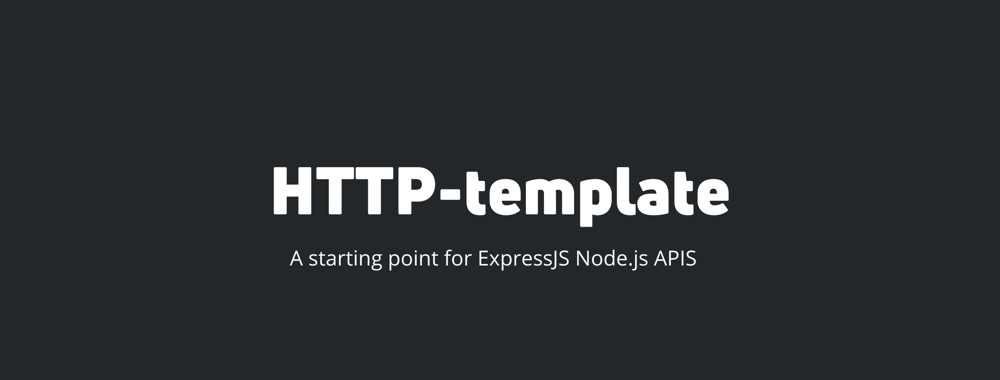

# Description
  HTTP-TEMPLATE is my personal starting point for many of my Node.js built APIs, the code is meant to be written in TypeScript, and has ESLint for TS linting installed.

# Usage
  - clone using `git clone https://github.com/zaida04/http-template/` or use this template
  - `npm i`
  - `npm start`
> **Be sure to change references to this project in your package.json**

# LICENSING
**HTTP-TEMPLATE** © [zaida04](https://github.com/zaida04), Released under the [MIT](https://github.com/zaida04/http-template.js/blob/master/LICENSE) License.  
Authored by zaida04.

> GitHub [@zaida04](https://github.com/zaida04) 
